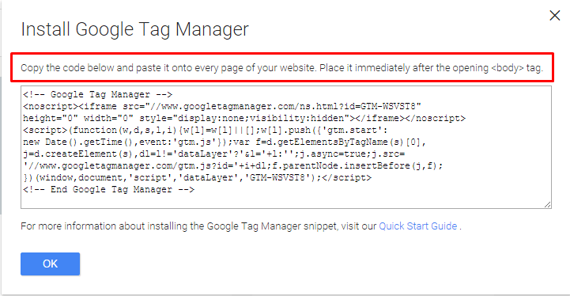
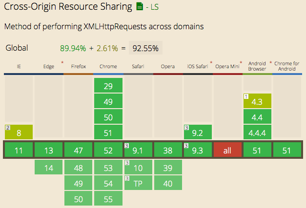
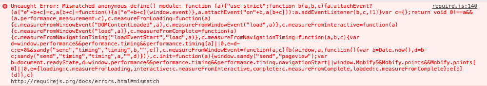

## Scripting in the 3<sup>rd</sup> Party
##### __True Tales of Horror and Hope from Other People's Pages__

Noah Adams

[@noah_adams](https://www.twitter.com/noah_adams)

---

### Who are you?
### Why should I believe you?


---

* Software Engineer at [Mobify](https://www.mobify.com/)
* Analytics and data products for e-commerce
* Billions of pageviews serviced (monthly)

---

## Third party scripts?

---

### What is a third party script?

* First party is the end-user
* Second party is the site's publisher
* Third parties are anybody else involved

---

<!-- .slide: data-background-image="images/google-analytics.png" .slide: data-color-swapped="true" -->
# Google Analytics

---

<!-- .slide: data-background-image="images/intercom.png" .slide: data-color-swapped="true" -->
# Intercom

---

<!-- .slide: data-background-image="images/disqus.png" .slide: data-color-swapped="true" -->
# Disqus

---

<!-- .slide: data-background-image="images/bazaarvoice.png" .slide: data-color-swapped="true" -->
## Bazaarvoice


---

<!-- .slide: data-background-image="images/social-sharing.png" .slide: data-color-swapped="true" -->
# Social Sharing

---

<!-- .slide: data-background-image="images/ads.png" .slide: data-color-swapped="true" -->
# __Ads__

---

### What is a third party script?

* Data collection and analytics
* Applications that add functionality to websites
* Integrations with other services

---

<!-- .slide: data-center="true" -->
#### Background


Note: Came out in 2013, and lots has changed since then, both in browser demographics, and tooling


---

### Where we go from here
* Integration and Delivery
* Building Defensively
* Tools, Testing and Iteration

---

## Integration and Delivery

---

## Don't Break
## The Site

---

It could be as simple as


```html
<script src="https://www.example.com/app.js" async></script>
```


---

But probably more like

```html
<!-- Google Analytics -->
<script>
(function(i,s,o,g,r,a,m){i['GoogleAnalyticsObject']=r;i[r]=i[r]||function(){
(i[r].q=i[r].q||[]).push(arguments)},i[r].l=1*new Date();a=s.createElement(o),
m=s.getElementsByTagName(o)[0];a.async=1;a.src=g;m.parentNode.insertBefore(a,m)
})(window,document,'script','https://www.google-analytics.com/analytics.js','ga');

ga('create', 'UA-XXXXX-Y', 'auto');
ga('send', 'pageview');
</script>
<!-- End Google Analytics -->
```

---

<!-- .slide: data-center="true" -->

Or you might be included with a tag manager



so meta

---

### How should we load?

* *__ASAP__*
* Without blocking rendering
* Without blocking `load` event
* Asynchronously

---

#### How should we load?

In phases, with a small payload and configuration early.

More as it's needed or convenient.

*__Once__* and cacheably.

---

### How do we integrate with the publisher's site?

---

### Bake in configuration

```javascript
if (window.Mobify && window.Mobify.Ajs) {
  var ajs_cfg = {"project": {"universal_analytics_id": "UA-55555555-5",
    "features": {"messaging": {"site_id": "example", "source_url": "https://webpush-cdn.mobify.net/webpush-client-loader.min.js?site_id=example"},
    "smart_content": {"business_slug": "example"},
    "performance_measurement": {},
    "content_parser": {"parser": "example"}, "sandy_adapter": {}},
    "record_mobile_analytics": true,
    "record_desktop_analytics": true, "slug": "example"},
    "project_type": "core", "analytics_site_url": "//a.mobify.com"} || {};
  window.Mobify.Ajs.init(ajs_cfg);
}
```

---

#### Global Hooks

```javascript
RSR.onInit = function(lib) {
  lib.configure({
    rockem: true,
    sockem: 'robots'
  })
}
```

---

#### Command Queue Pattern

```javascript
window['GoogleAnalyticsObject'] = 'ga';
window['ga']=window['ga'] || function() {
    (window['ga'].q = window['ga'].q || []).push(arguments)
}
```

makes

```javascript
ga('create', 'UA-XXXXX-Y', 'auto');
ga('send', 'pageview');
```

interface work before library loads

---

#### Markup Conventions

```html
<div data-service="core.config.bazaarvoice" data-config="{...}"></div>
```

---

### Load without blocking the critical path
Set `async` attribute on scripts.

---

<!-- .slide: data-background-image="images/async-support.png" -->

Note:
Support at over 90% as of August 2016

---

### Load without blocking the critical path
More complicated programmatic async loading for older browers.

---

#### Load more without blocking the load event

* XHR, then inject
* Wait until after load
* ...or block the load event

---

#### Delivering Your Code

* Minify, gzip, optimize images, etc.
* [Cache! Cache! Cache!](http://dev.mobify.com/blog/beginners-guide-to-http-cache-headers/)
* Only your loader needs short cache time
* Use a CDN for everything you can

---

#### Delivering Your Code

### [Deploying Client Side Apps, 1,000 at a Time](https://www.youtube.com/watch?v=ZXlZTcv743Y)
by Rebecca Murphey at CascadiaFest 2015

Note:
issues like per client configuration

---

## \*A note about security

---

### Your application becomes part of your consumers' attack surface.

---

#### It can do anything to the front end.
#### It can introduce:
unauthorized access, XSS, credential leaks, credit card scraping, etc.

---

<!-- .slide: data-background-image="images/missile-defense.gif" -->
## Building Defensively

---

### Don't Let the Site Break You

---

Web pages have become complex systems

---

<!-- .slide: data-background-image="images/kinetic-installation.gif" -->

---

<!-- .slide: data-background-image="images/rube-goldberg-machine.gif" -->

Note: Sites with lots of 3rd party JS are built from different things that are built non-uniformly and their interactions can be difficult to reason about

---

<!-- .slide: data-background-image="images/skynet.gif" -->

---

### Building Styles Defensively

---

### Container with a Unique Selector

```html
<div id="intercom-container" class="intercom-container intercom-reset">
  ...
</div>
```

---

<!-- .slide: data-background-image="images/reset.png" .slide: data-color-swapped="true" -->
## Mother of all Resets

---

#### Want to integrate page styles and your own UI styles?
That sounds hard...

---

You might be able to avoid some of this with CSS modules.

---

### Building JS Defensively

---

Let's combine every active browser variant, with every historical version of every library.

---

Also, you are contending for every resource: Memory, cookie space, local storage, IndexedDB, the global namespace, etc.

And if you misuse it, you might break the publisher's site.

---

### Some examples of what can go wrong

---

<!-- .slide: data-background-image="images/stack-overflow-prototype.png" -->

---

<!-- .slide: data-background-image="images/mozilla-jschannels-prototype.png" -->

---

Problems most web developers have long forgotten, are yours to contend with today!
#### This was fixed in Prototype 1.7 in 2010

---

#### A recent example from my own experience

---

# 🔥🔥🔥
## 🚒 🚒
Checkout broken for a customer, apparently by switching to XHR GET for tracking pixel from `` element

---

### Root cause:
A very ambitious XMLHttpRequest interception code accidentally picking up analytics calls, and doing bad things to the page.

---

### Solution
Don't trust

#### `window.XMLHttpRequest`

---

### Find our own fresh one

```javascript
var iframe = document.createElement('iframe');
var firstScript = document.getElementsByTagName('script')[0];
firstScript.parentNode.insertBefore(iframe, firstScript);
var cleanXHR = iframe.contentWindow.XMLHttpRequest;
```
\#stupidiframetricks

---

### Making Cross-Domain Requests

---



---

### Making Cross-Domain Requests
* You can probably just use XHR and CORS
* If not, there's always [easyXDM](http://easyxdm.net/wp/)

---

## Tools, Testing and Iteration

---

The environment of other peoples' pages puts the same demands on your tools and dependencies that it puts on your code.

---

## Don't Break
## The Site

---

#### \*A note about modules and build tools

---

<!-- .slide: data-center="true" -->

One day this happened:



---

#### Universal Module Definition

```javascript
(function (root, factory) {
    if (typeof define === 'function' && define.amd) {
        define(['b'], function (b) {
            return (root.returnExportsGlobal = factory(b));
        });
    } else if (typeof module === 'object' && module.exports) {
        module.exports = factory(require('b'));
    } else {
        root.returnExportsGlobal = factory(root.b);
    }
}(this, function (b) {
    return {};
}));
```

---

The dynamic checks for the presence of module loaders can go down an unexpected code path if several are present.

---

If code is loading asynchronously, you can create race conditions in the module loading.

---

### Testing

---

#### Write unit tests.

---

 Write integration tests against your built files, test for things like global variable leaks from your build tools.

---

### Run them against _**lots**_ of browsers.

---

### [Sauce Labs](https://saucelabs.com/javascript/),
### [Browser Stack](https://www.browserstack.com/) &
### [Testling](https://ci.testling.com/)
can help you with this

---

#### Build a way to test new versions of your third party scripts against running versions of peoples' pages.

---

### What we covered

* Integration and Delivery
* Building Defensively
* Tools, Testing and Iteration

---

# Final Notes

---

Writing third party JS is fraught with peril.

---

It is also very powerful: You can deliver new features across every site that integrates with you as fast as you can develop and test them.

---

# Thanks!
## Slides: [bit.ly/3rdpartyjs](https://bit.ly/3rdpartyjs)
## [@noah_adams](https://www.twitter.com/noah_adams)
## [GH:noahadams](https://github.com/noah_adams)
